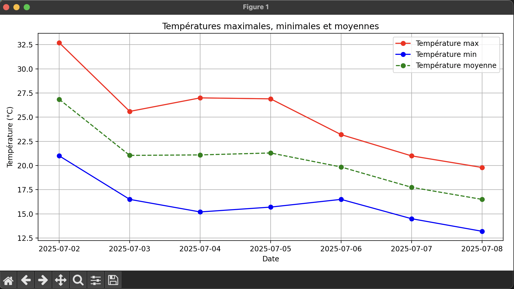

# Analyse météo réelle avec Open-Meteo

Ce projet propose un système d'analyse météo basé sur l'API publique Open-Meteo, en appliquant une démarche TDD (Test-Driven Development).

## Fonctionnalités

- Récupération des prévisions météo sur 7 jours pour Paris (lat=48.85, lon=2.35)
- Analyse des températures max/min
- Sauvegarde des résultats dans un fichier `meteo.json`
- Visualisation graphique avec matplotlib
- Tests unitaires et d'intégration

## Aperçu du graphique



## Exemple de données météo


## Installation

```
pip install -r requirements.txt
```

## Utilisation

```
python demo.py
```

## Tests

```
pytest
```

## API utilisée

- https://open-meteo.com
